# Shaahil Shamal Chand Portfolio

## Git:
https://github.com/shaahilchand?tab=repositories

The purpose of my portolio is to project my programming experience through in an easy to navigate format by including sections such as; home, about, skills, work. My goal was to have all contents to fit within the view, so to achieve this I made multiple pages with all respective contents wihtin them using links to navigate between them. I aim to further improve and update my portfolio in future to portray my work overtime to potential empoyers. 

The tech stack to build and design the portfolio include:
-HTML
-CSS

## Sitemap:
This is the way the portfolio is set up and it can be seen that the navigation and social media links are repearted throughout.
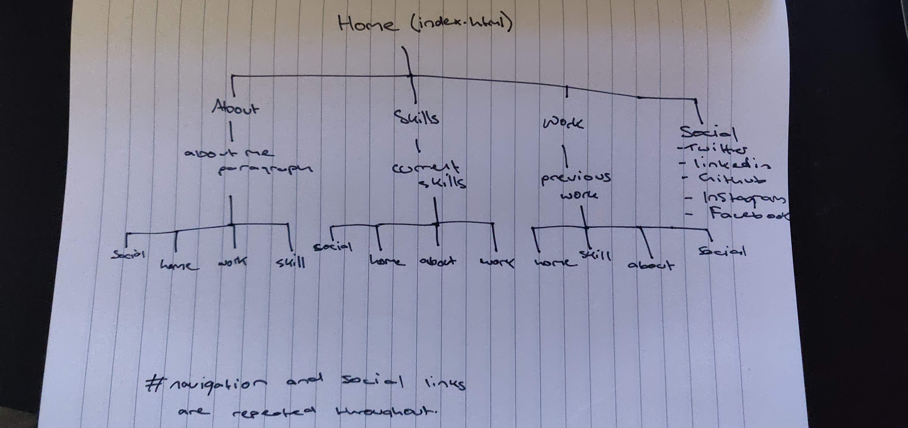

## Screenshots:

### Home
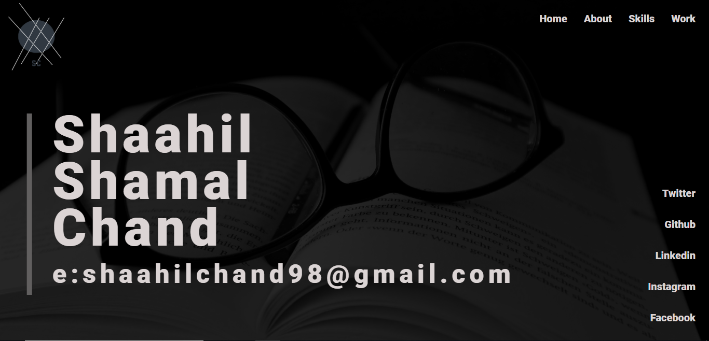

### About
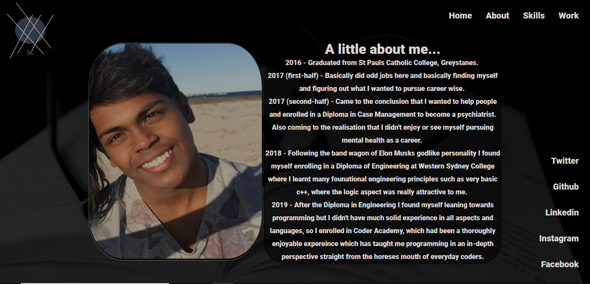

### Skills
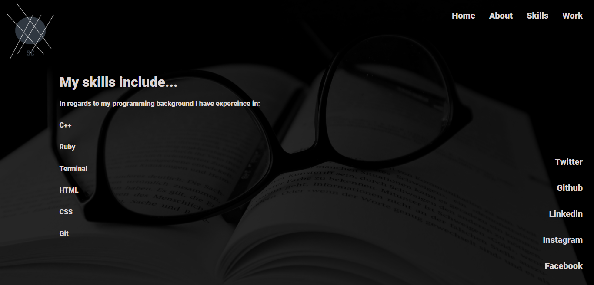

### Work
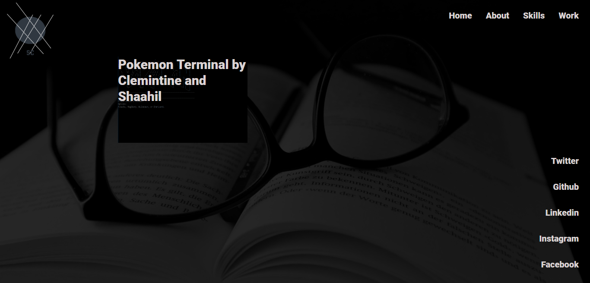

## Desgin Process:
The basic wireframe for the portfolio. 

### Home Design
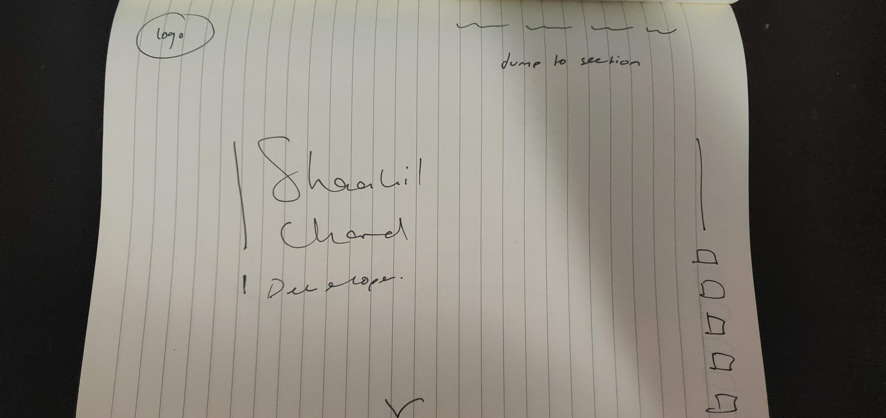

### About Design
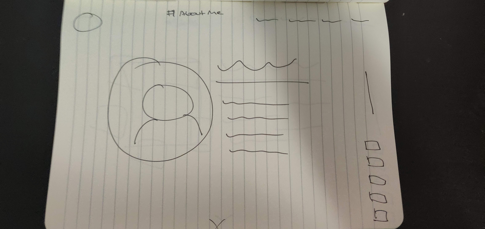

### Skills Design
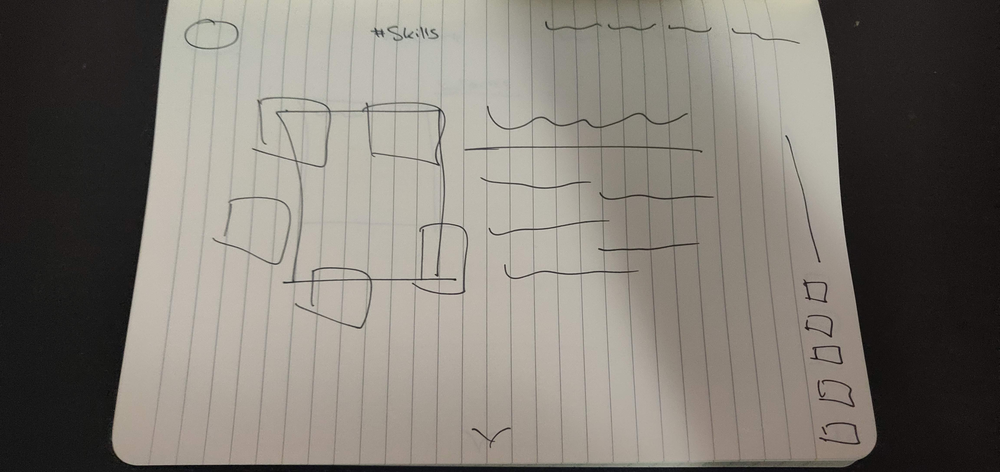

### Work Design

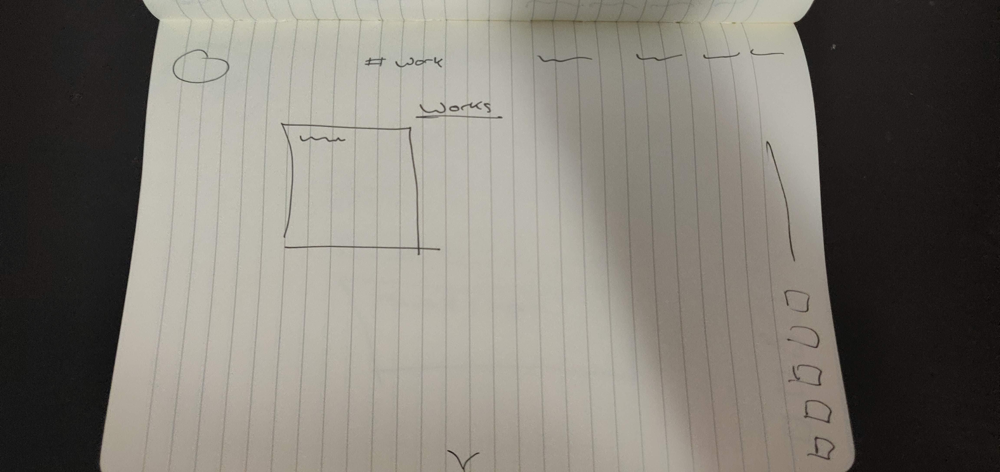

## Trello:
First steps of everything I was planning to implement in my portfolio.
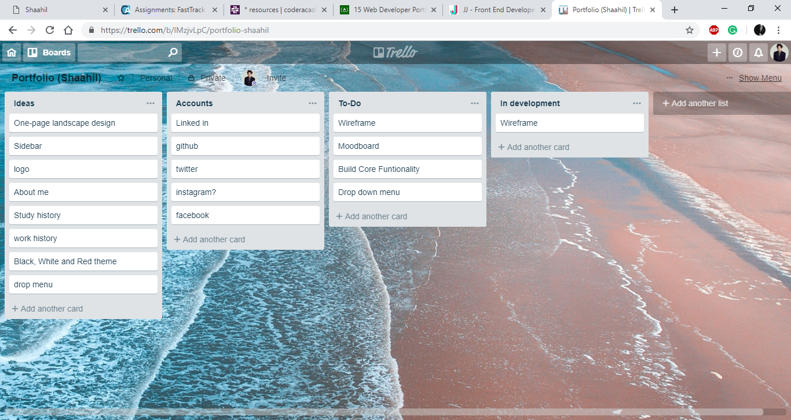

What I have accomplished and needed to continue, unfortunately some aspects had to be cut, however, they will be implemented in future. 

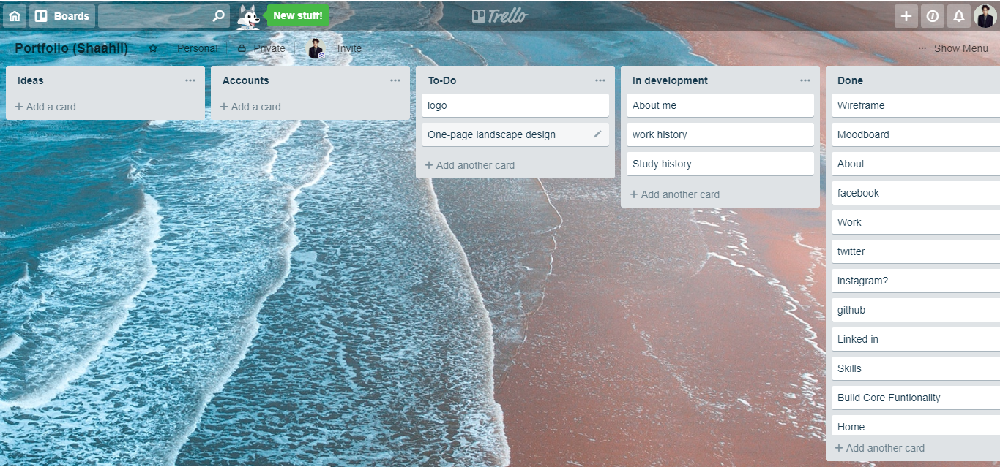

## Timeline

### Day 1-3 

<li>Designing</li>

### Day 4-6

<li>Building code</li>

### Day 7

<li>Documentation</li>

## Usability:

In regards to usability I used the lang = "en" to assist the browser and declare the language, for instance, when the computer reads and recites the contents of the page back to the user it will always recite english. To improve usability in future I would implement more languages to reach a more diverse community. 

## Short Answers:

#### Describe key events in the development of the internet from the 1980s to today.
Some key events in the history of the internet include the launching of the ENQUIRE software  by the European Organisation for Nuclear Research, which allowed scientists in laboratories to keep track of people, software and projects through hyperlinks, also the development of the first emoticon by Scott Fahlman in 1982 (😊). In addition, 1985 brought the development of The WELL, a virtual community, which started out as a community of readers and writers of the Whole Earth Review. 1988 brought the Internet Relay Chat, which paved the way for real-time chat and instant messaging, while 1989 brought the proposal for the World Wide Web, with protocols finishing in 1990. Mosaic – the first graphical web browser for non-techies was released in 1993, with HoTMaiL, the first webmail service, being launched in 1996. 1998 saw the launching of the revolutionary web engine Google!, as well as internet based file sharing. The early 2000s saw the launching of Wikipedia, as well as the first “Internet Election”. 

#### Define and describes the relationship between fundamental aspects of the internet such as: domains, web servers, DNS, and web browsers.
Simply put, a domain is the web address that you type in or search on the internet. Examples are Google.com, Netflix.com, Yahoo.com, etc. Humans access information online through domain names, like nytimes.com or espn.com. Web browsers interact through Internet Protocol (IP) addresses. DNS translates domain names to IP addresses so browsers can load Internet resources. A web server is a program that runs a website by returning html files over a HTTP connection.

#### Reflect on one aspect of the development of internet technologies and how it has contributed to the world today.
The emergence of social networking (2000-2004)
In accordance with the concept of peer-to-peer networks Skype was born in 2003), allowing users to make free calls to others, later branching out to include video messaging and video-conferencing. Video technology was soon considered for use in other industries, such as medicine, allowing doctors to examine and also treat patients thousands of kilometres away.
Consequently, networking sites started to emerge offering an alternative. Professional networking site LinkedIn launched in May 2003, followed by MySpace in August. Meanwhile, Harvard student Mark Zuckerberg introduced his peers to The Facebook, a social networking site built for students, with more than 1,000 students signing up on the first day. Gmail entered the market enticing users with greater storage than various other mail providers at the time. Social networking has allowed tremendous movements in globalisation, commerce, business, education and telecommunications, allowing for people far and wide to communicate in an instant, relay visual and audio information.# shaahil-portfolio
